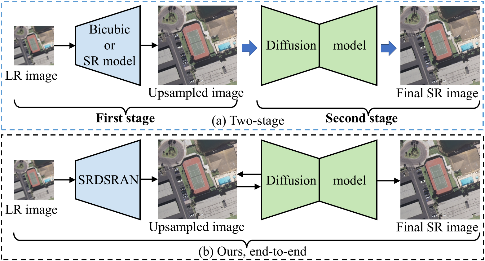
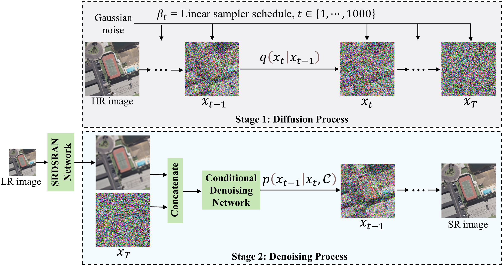
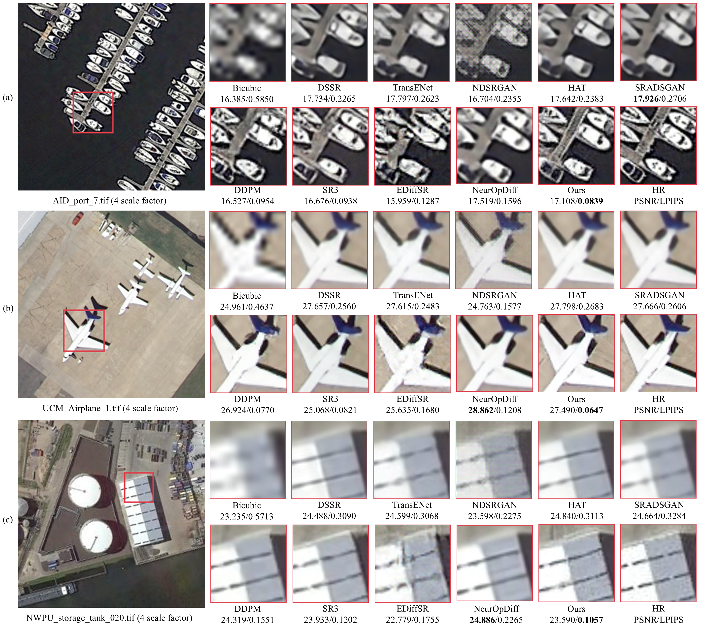
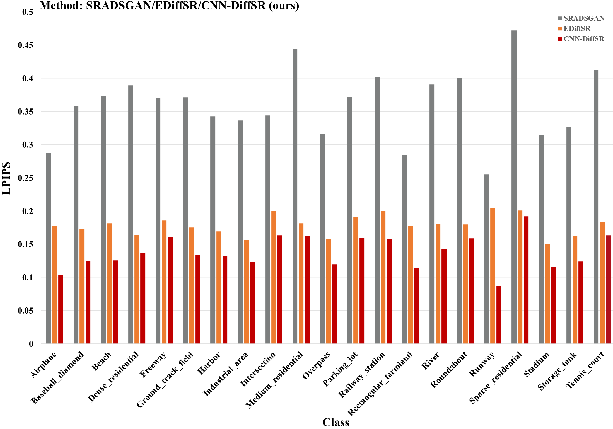
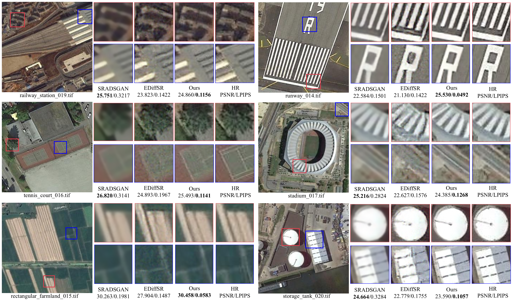
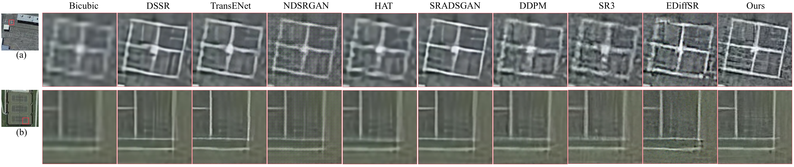

# **CNN-DiffSR**
**Single Remote Sensing Image Super-Resolution via Convolutional Neural Network and Diffusion Model**

  - Fanen Meng, Zhiguo Jiang, Fengying Xie, Sensen Wu, Zhenhong Du, Haopeng Zhang
  - *IEEE Journal of Selected Topics in Applied Earth Observations and Remote Sensing*, vol. 19, pp. 2641–2657
  - https://ieeexplore.ieee.org/document/11515151
  - checkpoint: Link: https://pan.baidu.com/s/1ZYW09S4JiWNd_8_x_WdxDw?pwd=0115 or https://drive.google.com/drive/folders/1SdSU1Q9nca-aQZkf5lEQ6fplRtsVNELp?usp=sharing


Fig. 1. Diffusion-based super-resolution methods for remote sensing images. (a) Existing two-stage method: two models are trained independently, resulting in poor model compatibility and a time-consuming training process. (b) The proposed end-to-end method: a CNN model guides the diffusion model, with both trained simultaneously and parameters updated in real time, resulting in higher model compatibility and collaboration. 


Fig. 2. Framework structure of the CNN-DiffSR. The SRDSRAN network is trained end-to-end together with the conditional denoising network, and the parameters are saved together by the pytorch-lightning library. C are represents the initial SR image generated by the SRDSRAN, which is then concatenated with x_t in the channel dimension to a 6-channel image. 


## Folder Structure

Our folder structure is as follows:

```
├── CNN-DiffSR (code)
│   ├── archs
│   │   ├── __init__.py
│   │   ├── common.py
│   │   ├── CNN-DiffSR_unet_arch.py
│   ├── configs
│   │   ├── cnn-diffsr_x4.yaml
│   ├── data
│   │   ├── __init__.py
│   │   ├── rssr_datamodule.py
│   ├── litsr
│   │   ├── archs
│   │   |   ├── __init__.py
│   │   |   ├── srdsran_arch.py
│   ├── load (dataset)
│   │   ├── Train
│   │   ├── val
│   │   ├── Test
│   │   |   ├── AID_Test
│   │   |   ├── NWPU_Test
│   │   |   ├── UCM_Test
│   ├── models
│   │   ├── __init__.py
│   │   ├── CNN-DiffSR_model.py
│   ├── utils
│   │   ├── __init__.py
│   │   ├── srmd_degrade.py
│   ├── FID.py     (calculate fid metric separately)
│   ├── train.py
│   ├── test.py
│   ├── infer.py   (type == "LR_only")

│   ├── MSI_SR_model (DSSR,TransENet,NDSRGAN,HAT,SRADSGAN model)
│   ├── EDiffSR (EDiffSR model)
```

## Introduction

- CNN-DiffSR (Diffusion model architecture): 

  - Contains ten super-resolution models: ['DSSR', 'TransENet', 'NDSRGAN', 'HAT', 'SRADSGAN', 'DDPM', 'SR3', 'EDiffSR', 'NeurOpDiff', '**CNN-DiffSR**']
  - MSI_SR_model (traditional generative model architecture): This project is based on [[sradsgan]](https://github.com/Meng-333/SRADSGAN) 
  - EDiffSR (conditional diffusion model): This project is based on [[ediffsr]](https://github.com/XY-boy/EDiffSR) 


## Environment Installation

Our method uses python 3.8, pytorch 1.11, pytorch-lightning 1.5.5, other environments are in requirements.txt

```bash
pip install -r requirements.txt
```

## Dataset Preparation

We used three datasets to evaluate our model. After secondary processing, we obtained a total of about 12, 041 images of 256*256 size. 

- Train

  - ["AID", "UC Merced"]

- Test

  - ["AID", "UC Merced", "NWPU-RESISC45"]

- Infer

  - ["NWPU-RESISC45"]

- Link: https://pan.baidu.com/s/1ZYW09S4JiWNd_8_x_WdxDw?pwd=0115  提取码：0115 or https://drive.google.com/drive/folders/1SdSU1Q9nca-aQZkf5lEQ6fplRtsVNELp?usp=sharing

  

## Train & Evaluate

1. Prepare environment, datasets and code.
2. Run training / evaluation code. The code is for training on 1 GPU.

```bash
# CNN-DiffSR
cd CNN-DiffSR 
# train
python train.py --config configs/cnn-diffsr_x4.yaml
# test
python test.py --checkpoint logs/cnn-diffsr_x4/version_0/checkpoints/epoch=483-step=643235.ckpt
# infer
python infer.py --checkpoint logs/your_checkpoint_path
---------------------------------------------------------------
# DDPM,SR3 (the same as above)
# DSSR,TransENet,NDSRGAN,hat,SRADSGAN:
cd MSI_SR_model
python main_dssr.py
python main_transenet.py
python main_ndsrgan.py
python main_sradsgan.py
---------------------------------------------------------------
net.train()                       # train
net.mfeNew_validate()             # test
net.mfeNew_validateByClass()      # 21 classes test
---------------------------------------------------------------
# EDiffSR
cd EDiffSR/codes/config/sisr
python train.py -opt=options/train/cnn-diffsr_train.yml            # train
python test.py -opt=options/test/cnn-diffsr_test.yml               # test

```

## Results

### 1. Comparison with the state-of-the-art methods




**Fig. 6.** Visual comparisons of experiments on AID, UC Merced, and NWPU-RESISC45 datasets. (a)–(c) are the ×4 SR results for AID, UC Merced, and NWPU-RESISC45 samples, respectively.


### 2.  Results on different classes of NWPU-RESISC45 images



**Fig. 7.** LPIPS results of SRADSGAN, EDiffSR, and CNN-DiffSR on 21 classes of the NWPU-RESISC45 dataset. Red denotes the best result.




**Fig. 8.** Visual comparisons of experiments on the NWPU-RESISC45 dataset. Here we show six typical scenes.


### 3. Real-world remote sensing image super-resolution



**Fig. 9.** Visual comparisons of 4x super-resolution experiments on real-world images. (a) and (b) are basketball_court_600.tif and tennis_court_029.tif images from the NWPU-RESISC45 dataset.
